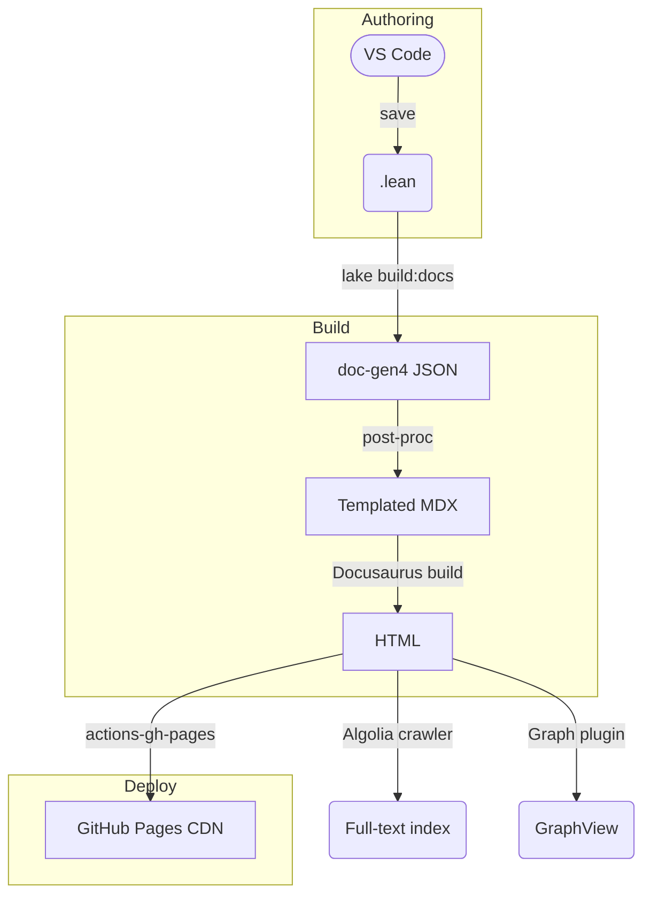

# Idea

This document outlines the design for MathUniverse, an interactive, web-based knowledge OS for formal mathematics. It aims to bridge rigorous Lean proofs with reader-friendly explanatory content, leveraging automated documentation generation, interactive code widgets, and visual knowledge graphs to create a dynamic learning and research environment.

## Target Audience

This document outlines a system designed for mathematics students (undergraduate and graduate), researchers, Lean language users, and open-source contributors interested in creating and exploring an interactive formal mathematics knowledge base.

## UX Design

### Core Features

| #   | Feature                                                                                                                                                            | Design Notes                                                                                                                                                                                                                                                                                                                                                                          |
| --- | ------------------------------------------------------------------------------------------------------------------------------------------------------------------ | ------------------------------------------------------------------------------------------------------------------------------------------------------------------------------------------------------------------------------------------------------------------------------------------------------------------------------------------------------------------------------------- |
| 1   | **Zero-friction capture** — commit Lean files anywhere in the repo; saving them in VS Code auto-triggers `lake build :docs` via the Lean4 extension's "watch" mode | VS Code extension publishes file-save events and can run arbitrary tasks – lean4-specific tasks are first-class ([GitHub](https://github.com/leanprover/vscode-lean4?utm_source=chatgpt.com))                                                                                                                                                                                         |
| 2   | **Automatic article generation** with `doc-gen4` → JSON → MDX                                                                                                      | `doc-gen4` walks every declaration, emits semantic JSON, and renders default HTML – you hook a post-processor that rewrites JSON → the templated Markdown below ([GitHub](https://github.com/leanprover/doc-gen4?utm_source=chatgpt.com), [Leanコミュニティ](https://leanprover-community.github.io/archive/stream/270676-lean4/topic/doc-gen4.20broken.html?utm_source=chatgpt.com)) |
| 3   | **Interactive code blocks** via *lean4web* playground widgets                                                                                                      | Each theorem/definition renders an editable, browser-side Lean editor (server mode possible for large mathlib) ([live.lean-lang.org](https://live.lean-lang.org/?utm_source=chatgpt.com), [GitHub](https://github.com/leanprover-community/lean4web?utm_source=chatgpt.com))                                                                                                          |
| 4   | **Visual knowledge graph & backlinks** powered by *Docusaurus GraphView*                                                                                           | GraphView reads MDX front-matter and note-graph metadata to draw a force-directed graph ([GitHub](https://github.com/Arsero/docusaurus-graph?utm_source=chatgpt.com), [Docusaurus Community Resources](https://docusaurus.io/community/resources?utm_source=chatgpt.com))                                                                                                             |
| 5   | **Full-text, typo-tolerant search** with Algolia DocSearch                                                                                                         | Free for OSS; crawler auto-indexes every deploy – add the snippet to your theme ([DocSearch Site](https://docsearch.algolia.com/?utm_source=chatgpt.com), [DocSearch Program](https://docsearch.algolia.com/docs/docsearch-program?utm_source=chatgpt.com))                                                                                                                           |
| 6   | **One-click dark/light, mobile-first theme** (Docusaurus default)                                                                                                  | No custom CSS needed; theme-classic ships toggle and responsive drawer ([Docusaurus Community Resources](https://docusaurus.io/community/resources?utm_source=chatgpt.com))                                                                                                                                                                                                           |
| 7   | **Instant publish** through `peaceiris/actions-gh-pages`                                                                                                           | Pushes the static `/build` folder to the `gh-pages` branch – widely adopted (17 k ★) ([GitHub](https://github.com/peaceiris/actions-gh-pages?utm_source=chatgpt.com), [GitHub Marketplace](https://github.com/marketplace/actions/github-pages-action?utm_source=chatgpt.com))                                                                                                        |

### Primary Use Cases

1. **Undergraduate or graduate student** — browses prerequisite panels to spot which lemmas must be learned before tackling a theorem; edits Lean snippets in-browser to test variations.
2. **Open-content contributor** — forks the repo, writes Lean proofs, opens a PR; CI shows a preview URL with the updated graph, making review intuitive.
3. **Researcher** — queries the JSON-LD API to integrate formal results into a Jupyter notebook or a citation database.

---

## Information Architecture & Metadata

Every generated page now carries *two* blocks:

```yaml
# YAML front-matter (human-friendly)
id: van_der_waerden
name: Van der Waerden's theorem
type: theorem
category: Pure mathematics
field: Discrete Mathematics & Combinatorics
subfield: Ramsey theory
uses: [szemeredi, arithmetic_progression]
serves: [polychromatic_vdw]
examples: []
git_sha: ab12c34
lean_version: 4.10.0
mathlib_rev: 2025-05-10
doi: 10.1234/vdw-lean2025
---

```jsonld
{
  "@context": "https://schema.org",
  "@type": "ScholarlyArticle",
  "identifier": "van_der_waerden",
  "name": "Van der Waerden's theorem",
  "keywords": ["combinatorics", "ramsey theory"],
  "version": "ab12c34",
  "isBasedOn": "https://github.com/user/repo/tree/ab12c34",
  "url": "https://site.example.com/theorems/van_der_waerden"
}
```

The YAML front-matter attributes are defined as follows:

| Attribute      | Definition                                                                                               |
| -------------- | -------------------------------------------------------------------------------------------------------- |
| `id`           | A unique machine-readable identifier for the page or concept (e.g., `van_der_waerden`).                  |
| `name`         | A human-readable name or title for the page or concept (e.g., "Van der Waerden's theorem").              |
| `type`         | The nature of the content (e.g., `theorem`, `definition`, `article`).                                    |
| `category`     | The broad area of mathematics the content belongs to (e.g., `Pure mathematics`, `Applied mathematics`).  |
| `field`        | A specific branch of mathematics within the category (e.g., `Algebra`, `Number Theory`).                 |
| `subfield`     | A specialized area of study within the field (e.g., `Ramsey theory`, `Algebraic number theory`).         |
| `uses`         | A list of `id`s of prerequisite concepts or theorems (e.g., `[szemeredi, arithmetic_progression]`).      |
| `serves`       | A list of `id`s of concepts or theorems that build upon this one (e.g., `[polychromatic_vdw]`).          |
| `examples`     | A list of `id`s or brief descriptions of illustrative examples related to the content.                   |
| `git_sha`      | The Git commit SHA associated with the version of the Lean code or content (e.g., `ab12c34`).            |
| `lean_version` | The version of the Lean language used for the formal proofs (e.g., `4.10.0`).                            |
| `mathlib_rev`  | The revision or version of the Mathlib library used (e.g., `2025-05-10`).                                |
| `doi`          | The Digital Object Identifier for the content if it's formally published (e.g., `10.1234/vdw-lean2025`). |

The JSON-LD block makes the knowledge graph machine-queryable (e.g., for academic search engines or custom API integrations) and SEO-friendly by adhering to standard schemas like [schema.org](https://schema.org/ScholarlyArticle?utm_source=chatgpt.com). Fields like `isBasedOn` and `version` allow precise tracking of provenance and updates.

---

## System Design

### Static Generation Pipeline



### CI/CD Workflow (essential steps)

```yaml
name: docs
on:
  push:
    branches: [main]
jobs:
  build:
    runs-on: ubuntu-latest
    steps:
      - uses: actions/checkout@v4
      - uses: actions/setup-node@v4
        with: { node-version: '20' }
      - name: Cache mathlib
        uses: actions/cache@v4
        with:
          path: ~/.elan
          key: ${{ runner.os }}-elan-${{ hashFiles('lean-toolchain') }}
      - run: lake build :docs         # compiles & runs doc-gen4
      - run: npm ci && npm run build  # Docusaurus
      - name: Deploy
        uses: peaceiris/actions-gh-pages@v4
        with:
          github_token: ${{ secrets.GITHUB_TOKEN }}
          publish_dir: ./build

```

The flow fails fast on Lean errors; the cache prevents a full mathlib recompile on every run. ([GitHub](https://github.com/leanprover/doc-gen4?utm_source=chatgpt.com))

---

## Site Layer Enhancements

### Page Template (MDX excerpt)

```markdown
import LeanPlayground from '@site/src/components/LeanPlayground';

## Theorem

The finite coloring version of …

<LeanPlayground code={`import Mathlib
theorem ...`} />

{/* The uses.map(link) and serves.map(link) functions dynamically render lists of prerequisite and consequence theorems/definitions as clickable links, populated from the page's front-matter. */}
:::tip Prerequisites
{uses.map(link)}
:::

:::info Consequences
{serves.map(link)}
:::

```

The `<LeanPlayground>` component comes from *lean4web* and spins up an in-browser worker so readers can modify proofs live ([GitHub](https://github.com/leanprover-community/lean4web?utm_source=chatgpt.com)).

### Global Graph

Enable the `@arsero/docusaurus-graph` plugin and point it to the compiled MDX directory; the sidebar gets a "Graph" button that opens an interactive, zoomable dependency map of all pages ([GitHub](https://github.com/Arsero/docusaurus-graph?utm_source=chatgpt.com)).

### Search

Add the DocSearch snippet to `docusaurus.config.js`; Algolia's crawler runs automatically on every deploy, giving blazingly fast, typo-tolerant search – free for open-source sites ([docsearch.algolia.com](https://docsearch.algolia.com/?utm_source=chatgpt.com), [docsearch.algolia.com](https://docsearch.algolia.com/docs/docsearch-program?utm_source=chatgpt.com)).

### Math Rendering

Docusaurus pipes Markdown through Remark/rehype; enable KaTeX or MathJax via the official plugin.  For custom exports (PDF/ePub) call Pandoc with `--mathjax` ([Pandoc](https://pandoc.org/chunkedhtml-demo/3.6-math-rendering-in-html.html?utm_source=chatgpt.com)).

---

## Future Roadmap

| Phase | Goal                                         | Candidate Tools                                                                                       |
| ----- | -------------------------------------------- | ----------------------------------------------------------------------------------------------------- |
| v1.1  | REST / GraphQL endpoint for theorem metadata | Next.js API (for dedicated API routes) or Docusaurus + `next-plugin-graphql` (for integrated GraphQL) |
| v1.2  | Obsidian vault export with backlinks         | `obsidian-export` (leverage existing exporter) + custom script (for bespoke backlink formatting)      |
| v1.3  | Citation graph overlay (DOIs, MR numbers)    | Crossref API → JSON-LD enrichment (automated metadata fetching and integration)                       |

---

### Quick-start Checklist

1. **Install Lean 4 & `doc-gen4`** (`lake exe doc-gen4`) ([GitHub](https://github.com/leanprover/doc-gen4?utm_source=chatgpt.com))
2. **Scaffold Docusaurus site** (`npm create docusaurus@latest`) ([docusaurus.io](https://docusaurus.io/community/resources?utm_source=chatgpt.com))
3. **Write post-processor** converting `json` → MDX with front-matter.
4. **Copy CI workflow** above, push, confirm GitHub Pages link.
5. **Apply for Algolia DocSearch** (takes < 24 h for OSS). ([docsearch.algolia.com](https://docsearch.algolia.com/?utm_source=chatgpt.com))

These upgrades turn your initial concept into a robust, interactive, and fully automated **formal-math knowledge OS**—bridging rigorous Lean proofs and reader-friendly explanatory content.
