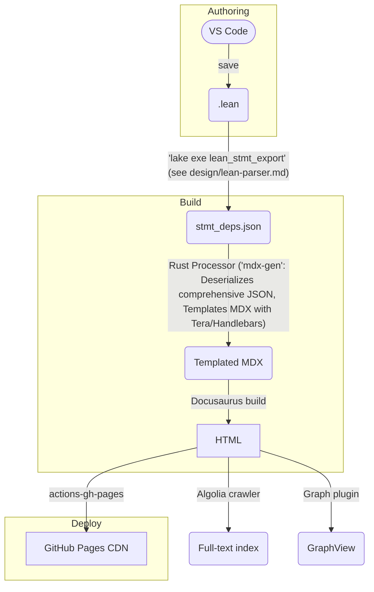

# Idea

This document outlines the design for MathUniverse, an interactive, web-based knowledge OS for formal mathematics. It aims to bridge rigorous Lean proofs with reader-friendly explanatory content, leveraging automated documentation generation, interactive code widgets, and visual knowledge graphs to create a dynamic learning and research environment.

## Target Audience

This document outlines a system designed for mathematics students (undergraduate and graduate), researchers, Lean language users, and open-source contributors interested in creating and exploring an interactive formal mathematics knowledge base.

## UX Design

### Core Features

| #   | Feature                                                                                                                                                             | Design Notes                                                                                                                                                                                                                                                                                                                                                                                                                                                                                                                                                                                                                                                                                                                   |
| --- | ------------------------------------------------------------------------------------------------------------------------------------------------------------------- | ------------------------------------------------------------------------------------------------------------------------------------------------------------------------------------------------------------------------------------------------------------------------------------------------------------------------------------------------------------------------------------------------------------------------------------------------------------------------------------------------------------------------------------------------------------------------------------------------------------------------------------------------------------------------------------------------------------------------------ |
| 1   | **Zero-friction capture** — commit Lean files anywhere in the repo; saving them in VS Code auto-triggers `lake exe genDecls` (Lean) & `cargo run -p mdx-gen` (Rust) | VS Code extension publishes file-save events and can run arbitrary tasks – Lean/Rust-specific tasks can be configured. ([GitHub](https://github.com/leanprover/vscode-lean4?utm_source=chatgpt.com))                                                                                                                                                                                                                                                                                                                                                                                                                                                                                                                           |
| 2   | **Automatic article generation** via `lean_stmt_export` (Lean) & `mdx-gen` (Rust)                                                                                   | The `lean_stmt_export` package (detailed in `design/lean-parser.md`) scans the Lean project, captures all declarations (including `axiom`, `def`, `theorem`, `example`, `inductive`, etc.), and exports a `stmt_deps.json` file. This JSON contains each statement's `id`, `kind`, `prerequisites`, and `consequences`. A Rust binary (`mdx-gen`) then parses this comprehensive JSON and renders final MDX pages using Tera/Handlebars templates. This refined process replaces `doc-gen4` and the need for Tree-sitter for examples within `mdx-gen`. ([Metaprogramming in Lean 4](https://leanprover-community.github.io/lean4-metaprogramming-book/main/02_overview.html?utm_source=chatgpt.com), [design/lean-parser.md]) |
| 3   | **Interactive code blocks** via *lean4web* playground widgets                                                                                                       | Each theorem/definition renders an editable, browser-side Lean editor (server mode possible for large mathlib) ([live.lean-lang.org](https://live.lean-lang.org/?utm_source=chatgpt.com), [GitHub](https://github.com/leanprover-community/lean4web?utm_source=chatgpt.com))                                                                                                                                                                                                                                                                                                                                                                                                                                                   |
| 4   | **Visual knowledge graph & backlinks** powered by *Docusaurus GraphView*                                                                                            | GraphView reads MDX front-matter and note-graph metadata to draw a force-directed graph ([GitHub](https://github.com/Arsero/docusaurus-graph?utm_source=chatgpt.com), [Docusaurus Community Resources](https://docusaurus.io/community/resources?utm_source=chatgpt.com))                                                                                                                                                                                                                                                                                                                                                                                                                                                      |
| 5   | **Full-text, typo-tolerant search** with Algolia DocSearch                                                                                                          | Free for OSS; crawler auto-indexes every deploy – add the snippet to your theme ([DocSearch Site](https://docsearch.algolia.com/?utm_source=chatgpt.com), [DocSearch Program](https://docsearch.algolia.com/docs/docsearch-program?utm_source=chatgpt.com))                                                                                                                                                                                                                                                                                                                                                                                                                                                                    |
| 6   | **One-click dark/light, mobile-first theme** (Docusaurus default)                                                                                                   | No custom CSS needed; theme-classic ships toggle and responsive drawer ([Docusaurus Community Resources](https://docusaurus.io/community/resources?utm_source=chatgpt.com))                                                                                                                                                                                                                                                                                                                                                                                                                                                                                                                                                    |
| 7   | **Instant publish** through `peaceiris/actions-gh-pages`                                                                                                            | Pushes the static `/build` folder to the `gh-pages` branch – widely adopted (17 k ★) ([GitHub](https://github.com/peaceiris/actions-gh-pages?utm_source=chatgpt.com), [GitHub Marketplace](https://github.com/marketplace/actions/github-pages-action?utm_source=chatgpt.com))                                                                                                                                                                                                                                                                                                                                                                                                                                                 |

### Primary Use Cases

1. **Undergraduate or graduate student** — browses prerequisite panels to spot which lemmas must be learned before tackling a theorem; edits Lean snippets in-browser to test variations.
2. **Open-content contributor** — forks the repo, writes Lean proofs, opens a PR; CI shows a preview URL with the updated graph, making review intuitive.
3. **Researcher** — queries the JSON-LD API to integrate formal results into a Jupyter notebook or a citation database.

---

## Information Architecture & Metadata

Every generated page now carries *two* blocks:

```yaml
# YAML front-matter (human-friendly)
id: van_der_waerden
name: Van der Waerden's theorem
type: theorem
category: Pure mathematics
field: Discrete Mathematics & Combinatorics
subfield: Ramsey theory
uses: [szemeredi, arithmetic_progression]
serves: [polychromatic_vdw]
examples: []
git_sha: ab12c34
lean_version: 4.10.0
mathlib_rev: 2025-05-10
doi: 10.1234/vdw-lean2025
---

```jsonld
{
  "@context": "https://schema.org",
  "@type": "ScholarlyArticle",
  "identifier": "van_der_waerden",
  "name": "Van der Waerden's theorem",
  "genre": "Pure mathematics",
  "keywords": ["Discrete Mathematics & Combinatorics", "combinatorics", "Ramsey theory"],
  "version": "ab12c34",
  "isBasedOn": "https://github.com/user/repo/tree/ab12c34",
  "url": "https://site.example.com/theorems/van_der_waerden"
}
```

The JSON-LD block makes the knowledge graph machine-queryable (e.g., for academic search engines or custom API integrations) and SEO-friendly by adhering to standard schemas like [schema.org](https://schema.org/ScholarlyArticle?utm_source=chatgpt.com). Fields like `isBasedOn` and `version` allow precise tracking of provenance and updates.

The following table defines the attributes used in the YAML front-matter:

| Attribute      | Definition                                                                                                                                                                                                                | Example from `idea.md`                 |
| :------------- | :------------------------------------------------------------------------------------------------------------------------------------------------------------------------------------------------------------------------ | :------------------------------------- |
| `id`           | A unique machine-readable identifier for the page or content item.                                                                                                                                                        | `van_der_waerden`                      |
| `name`         | The human-readable title or name of the content.                                                                                                                                                                          | `Van der Waerden's theorem`            |
| `type`         | The specific kind of content. Values can include `axiom`, `theorem`, `lemma`, `definition`, `example`, `inductive`, `constructor`, `recursor`, `opaque` (based on `lean_stmt_export` kinds, see `design/lean-parser.md`). | `theorem`                              |
| `category`     | The broad branch of mathematics the content belongs to.                                                                                                                                                                   | `Pure mathematics`                     |
| `field`        | A more specific area of mathematics within the category.                                                                                                                                                                  | `Discrete Mathematics & Combinatorics` |
| `subfield`     | A specialized topic or sub-discipline within the field.                                                                                                                                                                   | `Ramsey theory`                        |
| `uses`         | A list of identifiers for prerequisite concepts, theorems, or definitions that this content item builds upon.                                                                                                             | `[szemeredi, arithmetic_progression]`  |
| `serves`       | A list of identifiers for concepts, theorems, or definitions that build upon this content item.                                                                                                                           | `[polychromatic_vdw]`                  |
| `examples`     | References or links to illustrative examples related to the content.                                                                                                                                                      | `[]` (currently empty)                 |
| `git_sha`      | The Git commit SHA hash associated with the version of the file/content, for provenance tracking.                                                                                                                         | `ab12c34`                              |
| `lean_version` | The version of the Lean theorem prover used for any formal proofs associated with the content.                                                                                                                            | `4.10.0`                               |
| `mathlib_rev`  | The revision or version of the Mathlib library used, if applicable.                                                                                                                                                       | `2025-05-10`                           |
| `doi`          | Digital Object Identifier; a persistent link to the version of record if the content is formally published.                                                                                                               | `10.1234/vdw-lean2025`                 |

---

## System Design

### Static Generation Pipeline



### CI/CD Workflow (essential steps)

```yaml
name: docs
on:
  push:
    branches: [main]
jobs:
  build:
    runs-on: ubuntu-latest
    steps:
      - uses: actions/checkout@v4
      - uses: actions/setup-node@v4
        with: { node-version: '20' }
      # Add Rust setup if mdx-gen is not checked in as a binary
      # - name: Setup Rust
      #   uses: actions-rs/toolchain@v1
      #   with:
      #     toolchain: stable
      #     override: true
      - name: Cache mathlib
        uses: actions/cache@v4
        with:
          path: ~/.elan
          key: ${{ runner.os }}-elan-${{ hashFiles('lean-toolchain') }}
      - run: lake exe lean_stmt_export # Lean statement export (see design/lean-parser.md): exports stmt_deps.json
      - run: cargo run -p mdx-gen     # Rust: processes stmt_deps.json to generate .mdx
      - run: npm ci && npm run build  # Docusaurus
      - name: Deploy
        uses: peaceiris/actions-gh-pages@v4
        with:
          github_token: ${{ secrets.GITHUB_TOKEN }}
          publish_dir: ./build

```

The flow fails fast on Lean errors; the cache prevents a full mathlib recompile on every run. The Rust step (`mdx-gen`) should be built or available. ([Metaprogramming in Lean 4](https://leanprover-community.github.io/lean4-metaprogramming-book/main/02_overview.html?utm_source=chatgpt.com), [design/lean-parser.md], [Tera](https://keats.github.io/tera/docs/?utm_source=chatgpt.com), [Handlebars-Rust](https://github.com/sunng87/handlebars-rust?utm_source=chatgpt.com))

---

## Site Layer Enhancements

### Page Template (MDX excerpt)

#### Theorem Page Template (MDX excerpt)

```markdown
import LeanPlayground from '@site/src/components/LeanPlayground';

## Theorem

<LeanPlayground code={`{{insert the theorem here}}`} />

## Proof

<LeanPlayground code={`{{insert the proof here}}`} />

## Examples

{/* examples.map(link) will dynamically render links to example pages, populated from the page's front-matter. */}
{Array.isArray(examples) && examples.length > 0 && (
  <ul>
    {examples.map(ex => (
      <li key={ex.id}><a href={ex.url}>{ex.name}</a></li>
    ))}
  </ul>
)}

## Related Items

:::tip References To (Prerequisites)
{uses.map(link)}
:::

:::info Referenced By (Consequences)
{serves.map(link)}
:::

```

#### Axiom Page Template (MDX excerpt)

```markdown
import LeanPlayground from '@site/src/components/LeanPlayground';

## Axiom

<LeanPlayground code={`{{insert the axiom here}}`} />

## Examples

{/* examples.map(link) will dynamically render links to example pages, populated from the page's front-matter. */}
{Array.isArray(examples) && examples.length > 0 && (
  <ul>
    {examples.map(ex => (
      <li key={ex.id}><a href={ex.url}>{ex.name}</a></li>
    ))}
  </ul>
)}

## Related Items

:::info Referenced By (Consequences)
{serves.map(link)}
:::
```

#### Definition Page Template (MDX excerpt)

```markdown
import LeanPlayground from '@site/src/components/LeanPlayground';

## Definition

<LeanPlayground code={`{{insert the definition here}}`} />

## Examples

{/* examples.map(link) will dynamically render links to example pages, populated from the page's front-matter. */}
{Array.isArray(examples) && examples.length > 0 && (
  <ul>
    {examples.map(ex => (
      <li key={ex.id}><a href={ex.url}>{ex.name}</a></li>
    ))}
  </ul>
)}

## Related Items

:::tip References To (Prerequisites)
{uses.map(link)}
:::

:::info Referenced By (Consequences)
{serves.map(link)}
:::
```

#### Example Page Template (MDX excerpt)

```markdown
import LeanPlayground from '@site/src/components/LeanPlayground';

## Example

<LeanPlayground code={`{{insert the example here}}`} />

## Related Items

:::tip References To (Prerequisites)
{uses.map(link)}
:::
```

The `<LeanPlayground>` component comes from *lean4web* and spins up an in-browser worker so readers can modify proofs live ([GitHub](https://github.com/leanprover-community/lean4web?utm_source=chatgpt.com)). The `uses.map(link)`, `serves.map(link)`, and `examples.map(link)` functions (or similar logic) would dynamically render lists based on the page's front-matter.

### Global Graph

Enable the `@arsero/docusaurus-graph` plugin and point it to the compiled MDX directory; the sidebar gets a "Graph" button that opens an interactive, zoomable dependency map of all pages ([GitHub](https://github.com/Arsero/docusaurus-graph?utm_source=chatgpt.com)).

### Search

Add the DocSearch snippet to `docusaurus.config.js`; Algolia's crawler runs automatically on every deploy, giving blazingly fast, typo-tolerant search – free for open-source sites ([docsearch.algolia.com](https://docsearch.algolia.com/?utm_source=chatgpt.com), [docsearch.algolia.com](https://docsearch.algolia.com/docs/docsearch-program?utm_source=chatgpt.com)).

### Math Rendering

Docusaurus pipes Markdown through Remark/rehype; enable KaTeX or MathJax via the official plugin.  For custom exports (PDF/ePub) call Pandoc with `--mathjax` ([Pandoc](https://pandoc.org/chunkedhtml-demo/3.6-math-rendering-in-html.html?utm_source=chatgpt.com)).

---

## Future Roadmap

| Phase | Goal                                         | Candidate Tools                                                                                       |
| ----- | -------------------------------------------- | ----------------------------------------------------------------------------------------------------- |
| v1.1  | REST / GraphQL endpoint for theorem metadata | Next.js API (for dedicated API routes) or Docusaurus + `next-plugin-graphql` (for integrated GraphQL) |
| v1.2  | Obsidian vault export with backlinks         | `obsidian-export` (leverage existing exporter) + custom script (for bespoke backlink formatting)      |
| v1.3  | Citation graph overlay (DOIs, MR numbers)    | Crossref API → JSON-LD enrichment (automated metadata fetching and integration)                       |

---

### Quick-start Checklist

1. **Install Lean 4 & set up Lean metaprogramming export** (`lake exe lean_stmt_export` to produce `stmt_deps.json`, as detailed in `design/lean-parser.md`). ([Lean Metaprogramming Book](https://leanprover-community.github.io/lean4-metaprogramming-book/main/02_overview.html?utm_source=chatgpt.com), [design/lean-parser.md])
2. **Scaffold Docusaurus site** (`npm create docusaurus@latest`) ([docusaurus.io](https://docusaurus.io/community/resources?utm_source=chatgpt.com))
3. **Develop Rust crate (`mdx-gen`)** for parsing the `stmt_deps.json` (using `serde`) and MDX templating (`Tera` or `Handlebars`). ([Tera](https://keats.github.io/tera/docs/?utm_source=chatgpt.com), [Handlebars-Rust](https://github.com/sunng87/handlebars-rust?utm_source=chatgpt.com))
4. **Copy CI workflow** above (ensure Rust environment/binary for `mdx-gen` is handled), push, confirm GitHub Pages link.
5. **Apply for Algolia DocSearch** (takes < 24 h for OSS). ([docsearch.algolia.com](https://docsearch.algolia.com/?utm_source=chatgpt.com))

These upgrades turn your initial concept into a robust, interactive, and fully automated **formal-math knowledge OS**—bridging rigorous Lean proofs and reader-friendly explanatory content.
